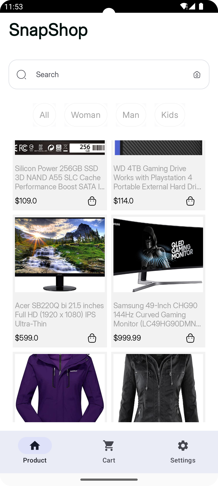

<h2 align="center">SnapShop</h2>

<p align="center">  
SnapShop demonstrates modern Android development with Jetpack Compose, Hilt, Coroutines, Jetpack (Room, ViewModel), 
and Material Design based on the MVVM architecture. The product technical documentation, features and feature status can be found
[here](https://docs.google.com/document/d/1mDm4si49bHxUk8xRmOo1fOWLm-Ar6loHMEFIEy06vbA/edit?usp=sharing)
</p>

<p align="start">
</p>

## Tech stack & libraries
- Minimum SDK level 24.
- Kotlin based, utilizing coroutines for asynchronous tasks.
- Jetpack Libraries:
    - Jetpack Compose
    - Lifecycle
    - ViewModel
    - Navigation 
    - Room
    - Hilt
- Architecture:
    - MVVM Architecture (View - ViewModel - Model)
    - Repository Pattern
- Retrofit2
- ksp
- Coil - Image loading library


## Architecture
**SnapShop** adheres to the MVVM architecture and implements the Repository pattern.
The architecture of **SnapShop** is structured into two distinct layers: the UI layer and the data layer. 

### Architecture Overview


## FakeStore API
SnapShop using the [FakeStoreAPI](https://github.com/keikaavousi/fake-store-api/) for constructing RESTful API.<br>

# License
```xml
Designed and developed by Eniola Ipoola

Licensed under the Apache License, Version 2.0 (the "License");
you may not use this file except in compliance with the License.
You may obtain a copy of the License at

   http://www.apache.org/licenses/LICENSE-2.0

Unless required by applicable law or agreed to in writing, software
distributed under the License is distributed on an "AS IS" BASIS,
WITHOUT WARRANTIES OR CONDITIONS OF ANY KIND, either express or implied.
See the License for the specific language governing permissions and
limitations under the License.
```
